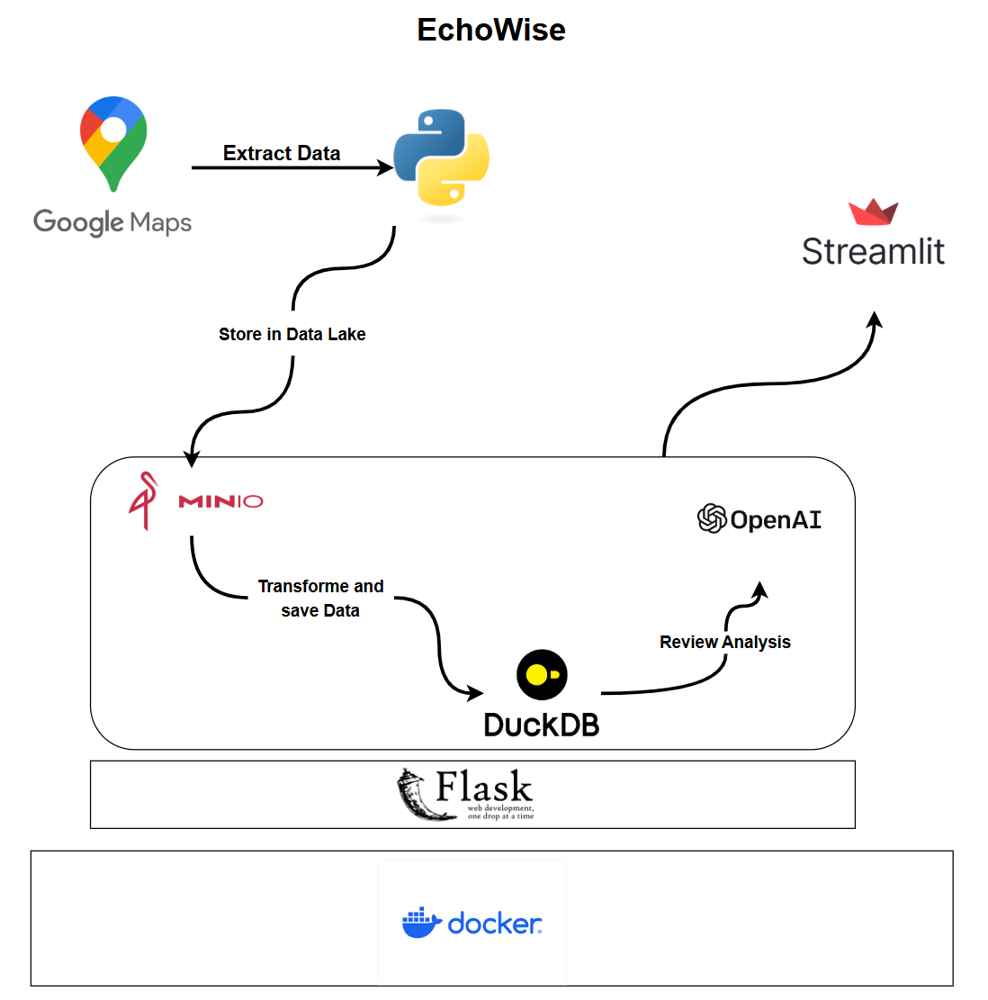

# EchoWize 🎯

## Vue d'ensemble 💫

EchoWise est une plateforme innovante d'analyse des avis clients, spécialement conçue pour les entreprises. Elle utilise des technologies avancées d'intelligence artificielle et d'analyse de données pour collecter, trier et interpréter les feedbacks clients provenant de multiples canaux.

## Objectifs 🎯

- **Centralisation des données clients** : Consolidation et unification des avis clients en temps réel
- **Analyse qualitative** : Utilisation du NLP pour l'analyse des sentiments et la catégorisation
- **Prise de décision proactive** : Alertes en temps réel et rapports automatisés
- **Automatisation** : Traitement efficace des grands volumes de données

## Architecture Technique 🔧

### Technologies Utilisées


- **Frontend** : Streamlit
- **Backend** : Flask (Python)
- **Base de données** : DuckDB
- **Stockage de données** : MinIO
- **API** : 
  - Google Maps API (extraction de données)
  - OpenAI API (analyse de sentiments)
- **Conteneurisation** : Docker

## Installation 🚀

1. Cloner le repository :
```bash
git clone https://github.com/votre-username/EchoWize.git
cd EchoWize
```

2. Installer les dépendances :
```bash
pip install -r requirements.txt
```

3. Configuration des variables d'environnement :
Créer un fichier `.env` avec :
```
GOOGLE_MAPS_API_KEY=votre_clé
OPENAI_API_KEY=votre_clé
```

4. Lancer avec Docker :
```bash
docker-compose up --build
```

## Structure du Projet 📁

```
EchoWize/
├── api/
│   ├── services/
│   ├── routes/
│   └── main.py
├── tests/
├── docker-compose.yml
├── Dockerfile
└── requirements.txt
```

## Fonctionnalités Principales 🌟

1. **Extraction de Données**
   - Collecte automatisée des avis depuis Google Maps
   - Stockage sécurisé dans MinIO

2. **Traitement des Données**
   - Transformation et nettoyage des données
   - Analyse de sentiments via OpenAI
   - Stockage structuré dans DuckDB

3. **Visualisation**
   - Interface utilisateur intuitive avec Streamlit
   - Tableaux de bord en temps réel
   - Rapports personnalisables

## Contribution 🤝

Les contributions sont les bienvenues ! Pour contribuer :

1. Forkez le projet
2. Créez votre branche (`git checkout -b feature/AmazingFeature`)
3. Committez vos changements (`git commit -m 'Add some AmazingFeature'`)
4. Poussez vers la branche (`git push origin feature/AmazingFeature`)
5. Ouvrez une Pull Request

## Licence 📝

Ce projet est sous licence MIT. Voir le fichier `LICENSE` pour plus de détails.